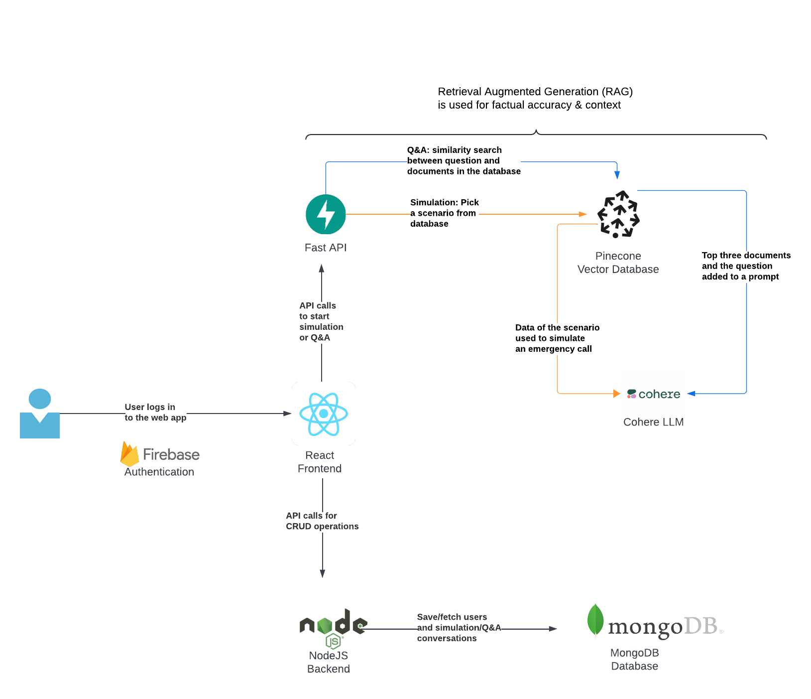

<!--<p align="center">
  <a href="" rel="noopener">
 </a>
</p>-->
<h3 align="center">Project name</h3>

<div align="center">

</div>

---

<p align="center"> This project is our solution to the Emergency Dispatch Conversation AI -challenge at MediHacks 2024 -Hackathon (https://www.medihacks.org/).

</p>

## 📝 Table of Contents
- [Problem Statement](#problem_statement)
- [Idea / Solution](#idea)
- [Prototype](#prototype)
- [Setting up a local environment](#getting_started)
- [Technology Stack](#tech_stack)
- [Authors](#authors)

## 🧐 Problem Statement <a name = "problem_statement"></a>

TODO --> add description from the challenge description document


## 💡 Idea / Solution <a name = "idea"></a>

TODO --> explain our idea, what are we trying to built

## ⛓️ Prototype <a name = "prototype"></a>

TODO --> describe how our solution was built - architecture diagram

[]


## 🏁 Getting Started <a name = "getting_started"></a>
These instructions will get you a copy of the project up and running on your local machine for development 
and testing purposes. 

### Prerequisites


### Installing

TODO --> should instructions contain how to run frontend and backend locally?

Install project dependencies:

```
npm install
```

To run this project locally run:

```
npm run dev
```

Run the Development Server: Once the dependencies are installed, you can start the development server by running:

This command will build the project and start a local development server. You'll see messages indicating that the project is being compiled and the server is running.

Access the Application: Open a web browser and navigate to http://localhost:3000. This is the default address where the React application will be served. You should see your React app running locally.


## ⛏️ Built With <a name = "tech_stack"></a>
- [React](https://www.react.dev/) - Frontend Framework
- [NodeJS](https://nodejs.org/) - JavaScript runtime environment
- [MongoDB](https://www.mongodb.com/) - NoSQL database
- [FastAPI](https://fastapi.tiangolo.com/) - A modern, fast (high-performance), web framework for building APIs
- [Pinecone](www.pinecone.io) - Vector database
- [Cohere](https://cohere.com) - Enterprise AI Platform

## ✍️ Authors <a name = "authors"></a>
- [@MeriemTerki](https://github.com/MeriemTerki) 
- [@adimidania](https://github.com/adimidania) 
- [@Mahiambaw](https://github.com/Mahiambaw) 
- [@mariberg](https://github.com/mariberg) 